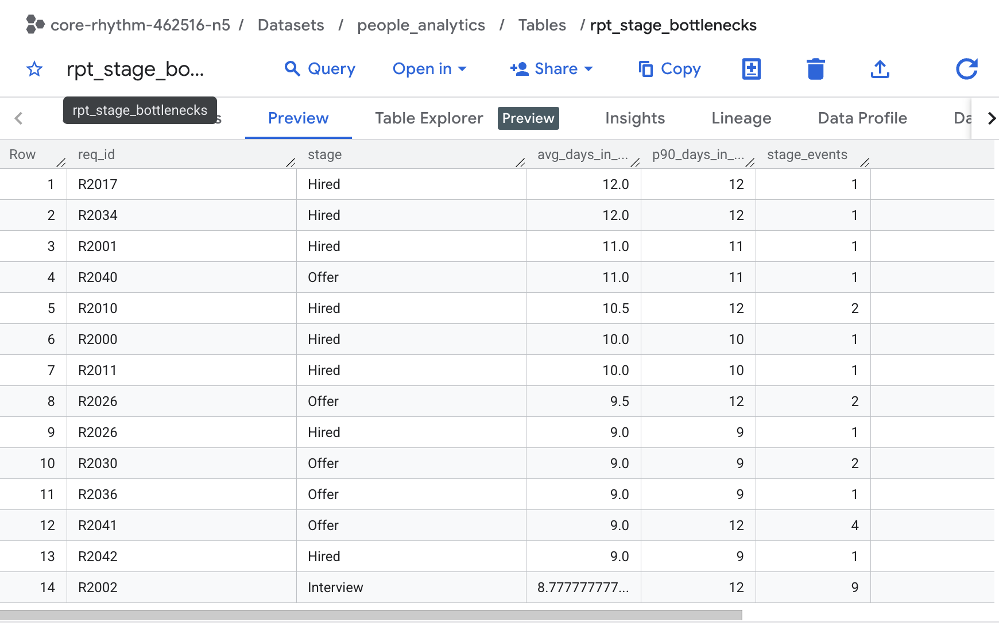

# People Analytics DWH + Executive Dashboard (HRIS + ATS → BigQuery → Looker Studio)

## Why this project
People Tech leaders need fast, reliable answers to:
- Where is **attrition risk** rising (by team/tenure/manager)?
- Which orgs are **unstable** (early attrition 0–90 days)?
- Where is the **hiring funnel** bottleneck?
- Which roles have high **time-to-hire** and low offer acceptance?

This repo demonstrates an end-to-end analytics workflow: **HRIS + ATS → modeled warehouse tables → executive dashboards**.

---
## Architecture

HRIS (Employees, Attrition, Performance)
ATS (Candidates, Hiring Funnel)
        ↓
BigQuery (people_analytics_dwh)
        ↓
Looker Studio (Executive Dashboard)

## How to run (BigQuery)

1. Install Google Cloud SDK (includes `bq`) and authenticate:
   - `gcloud auth login`
   - `gcloud auth application-default login`
2. Set your GCP project:
   - `gcloud config set project <PROJECT_ID>`
3. From the repo root, run the loader + model runner:
   - `bash scripts/bq_run_all.sh <PROJECT_ID> people_analytics_dwh US`
4. Confirm tables/views were created:
   - `bq --project_id=<PROJECT_ID> ls people_analytics_dwh`
   - You should see `stg_*`, `dim_*`, `fact_*`, `rpt_*`
5. Open Looker Studio → Create → Data Source → BigQuery
6. Select dataset: `people_analytics_dwh`
7. Use the `rpt_*` views as dashboard sources (recommended)
8. Refresh data + validate the dashboard screenshots match the `assets/` images.

**Pipeline:**
1) CSV sources → BigQuery staging  
2) SQL transformations → marts (facts/dims)  
3) Looker Studio dashboard → Executive KPIs + drilldowns
---

## Live Dashboard (Looker Studio)
View-only link: https://lookerstudio.google.com/s/qtmtqTS2tmc
 ### Screenshots
## Screenshots
### Executive Overview

### Attrition + Bottleneck

### Hiring Funnel

 
## Screenshots

!### Early Attrition (0–90 days)
Preview of `rpt_early_attrition_0_90` aggregated by department, location, and manager.

### Attrition by Department
Aggregated attrition by department with terminations and total headcount.

### Headcount Snapshot (Current)
Active headcount by department, location, and job level (leadership-friendly slice for workforce planning).

### Hiring Funnel (by Requisition)
ATS funnel table at requisition level (req_id, department, location, role_title) used to compute funnel conversion + bottlenecks.

### Offer Acceptance (Overall)
High-level offer acceptance KPI to monitor hiring health and candidate experience.

### Pipeline Bottlenecks (Stage Time)
Identifies slow stages in the hiring pipeline using average and p90 days-in-stage to surface bottlenecks.

---

## Dashboard Pages (planned)
### Page 1 — Executive Overview
- KPI cards: headcount, hires, exits, attrition %, early attrition %, open reqs, time-to-hire, offer acceptance
- Charts: attrition by dept, funnel conversion, time-to-hire by dept/role
- “Risk & Actions” box

### Page 2 — Attrition Deep Dive
- Attrition by department + tenure bands
- Early attrition analysis (0–90 days)
- Team/manager risk table

### Page 3 — Hiring Funnel Health
- Conversion rates by stage
- Bottleneck stage duration
- Time-to-hire distributions
- Source quality (optional)

---

## Repo Structure
assets/     dashboard screenshots  
data/       synthetic HRIS + ATS CSVs  
docs/       metrics dictionary, executive summary, data model diagram  
sql/        staging, marts, analysis queries  
notebooks/  data generation / exploration  

---

## Data (Synthetic)
Files in `/data`:
- `hris_employees.csv`
- `hris_terminations.csv`
- `ats_requisitions.csv`
- `ats_applications.csv`
- `ats_stage_events.csv`
- `ats_offers.csv`

---

## Documentation
- Metrics definitions: `docs/METRICS_DICTIONARY.md`
- Executive summary: `docs/executive_summary.md`
- Data quality checks: `sql/analysis/DATA_QUALITY_CHECKS.sql`

---
## Executive KPIs

- Active Headcount
- Net Headcount Growth
- Attrition Rate (Voluntary / Involuntary)
- Attrition Risk by Department & Tenure
- Time-to-Hire
- Offer Acceptance Rate
- Hiring Funnel Conversion

## Overview
This project builds a lightweight People Analytics data warehouse in BigQuery and a set of executive-ready reporting tables (headcount, attrition, hiring funnel, offer accept).
It includes repeatable SQL pipelines plus data quality checks that produce PASS/WARN/FAIL outputs for key tables and columns.
 - [sql/analysis/DATA_QUALITY_CHECKS.sql](sql/analysis/DATA_QUALITY_CHECKS.sql)
- [sql/analysis/VIEW_DQ_RESULTS.sql](sql/analysis/VIEW_DQ_RESULTS.sql)
## Data Quality Checks

Run checks:
- [sql/analysis/DATA_QUALITY_CHECKS.sql](sql/analysis/DATA_QUALITY_CHECKS.sql)

View latest results:
- [sql/analysis/VIEW_DQ_RESULTS.sql](sql/analysis/VIEW_DQ_RESULTS.sql)

Results table:
- `people_analytics.dq_results`

## Next milestones
- [ ] Load data into BigQuery + build staging tables
- [ ] Create marts (facts/dims) for headcount, attrition, funnel
- [ ] Build Looker Studio dashboard + publish link
- [ ] Add final screenshots + executive summary insights
